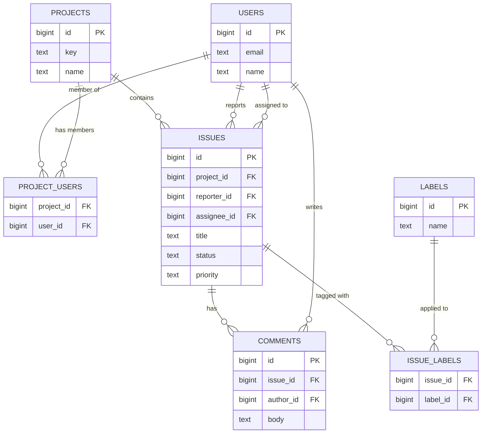

## Where Tier 1 left off

Tier 1 covered 1NF, 2NF, and 3NF conceptually — no repeating groups, every non-key column depending on the whole key, no column depending on another non-key column. That's assumed knowledge here. This module is the applied version: you're handed a page of real requirements, and you have to turn it into a working, evolvable schema — complete with the messy parts textbooks skip, like when to break normalization on purpose and how schema changes actually reach a production database.

## The requirements

You're building the database for a small issue tracker. Product hands you this:

> The tool supports multiple projects. Each project has a name and a short key (e.g. `ENG`, `OPS`). Users can belong to multiple projects, and a project can have multiple users assigned to it. Each issue belongs to exactly one project, has a title, a description, a status (`open`, `in_progress`, `closed`), a priority (`low`, `medium`, `high`), an assignee (one user, optional), and a reporter (the user who filed it, required). Issues can have any number of comments, each with an author, a body, and a timestamp. Issues can be tagged with multiple labels (like `bug` or `urgent`), and a label can apply to many issues. The dashboard shows, for every project, the count of open issues — and that dashboard is loaded dozens of times a minute.

That last sentence looks like a throwaway detail. It isn't — hang onto it.

## Step 1: find the entities and relationships

Read the requirements again and underline the nouns: **users**, **projects**, **issues**, **comments**, **labels**. Those are your candidate tables. Now find the verbs connecting them, because verbs tell you cardinality:

- A user **belongs to** many projects; a project **has** many users → many-to-many, needs a join table (`project_users`).
- A project **contains** many issues; an issue belongs to exactly one project → one-to-many.
- A user **reports** an issue (required) and may be **assigned** an issue (optional) → two separate one-to-many relationships from `users` to `issues`, so `issues` needs two foreign keys pointing at `users`.
- An issue **has** many comments; a comment belongs to one issue and one author → one-to-many twice.
- An issue **has** many labels; a label applies to many issues → many-to-many, needs a join table (`issue_labels`).

Notice what you did *not* do: you didn't start by typing `CREATE TABLE`. You resolved the relationships first. Deciding "many-to-many" before you've picked a single column name is what separates a schema that survives the next feature request from one that gets a `label_2` column bolted onto `issues` six months from now.

## Step 2: draw the ER diagram



Every many-to-many relationship became a join table with two foreign keys (`project_users`, `issue_labels`). Every "optional" relationship (assignee) is a nullable foreign key; every "required" one (reporter) is `NOT NULL`.

## Step 3: check it against 1NF–3NF

Quick pass, since you already know the rules: no column holds a list (labels live in their own join table, not a comma-separated string on `issues` — that's 1NF); every attribute on `issues` describes *that issue*, not something derivable from another table (2NF/3NF); and critically, `project_users.role` describes the *membership*, not the user or the project alone, so it lives on the join table, not smeared onto `users`. If this design were violating 3NF, you'd see it here — e.g., storing `project_name` directly on `issues` instead of just `project_id` would be a transitive dependency (project name depends on project, not on the issue). We don't do that. Yet.

## Step 4: turn the diagram into SQL

```sql
CREATE TABLE users (
    id          BIGSERIAL PRIMARY KEY,
    email       TEXT NOT NULL UNIQUE,
    name        TEXT NOT NULL,
    created_at  TIMESTAMPTZ NOT NULL DEFAULT now()
);

CREATE TABLE projects (
    id          BIGSERIAL PRIMARY KEY,
    key         TEXT NOT NULL UNIQUE,
    name        TEXT NOT NULL,
    created_at  TIMESTAMPTZ NOT NULL DEFAULT now()
);

CREATE TABLE project_users (
    project_id  BIGINT NOT NULL REFERENCES projects(id) ON DELETE CASCADE,
    user_id     BIGINT NOT NULL REFERENCES users(id) ON DELETE CASCADE,
    role        TEXT NOT NULL DEFAULT 'member',
    PRIMARY KEY (project_id, user_id)
);

CREATE TABLE issues (
    id            BIGSERIAL PRIMARY KEY,
    project_id    BIGINT NOT NULL REFERENCES projects(id) ON DELETE CASCADE,
    reporter_id   BIGINT NOT NULL REFERENCES users(id),
    assignee_id   BIGINT REFERENCES users(id),
    title         TEXT NOT NULL,
    description   TEXT,
    status        TEXT NOT NULL DEFAULT 'open'
                    CHECK (status IN ('open', 'in_progress', 'closed')),
    priority      TEXT NOT NULL DEFAULT 'medium'
                    CHECK (priority IN ('low', 'medium', 'high')),
    created_at    TIMESTAMPTZ NOT NULL DEFAULT now(),
    updated_at    TIMESTAMPTZ NOT NULL DEFAULT now()
);

CREATE TABLE comments (
    id          BIGSERIAL PRIMARY KEY,
    issue_id    BIGINT NOT NULL REFERENCES issues(id) ON DELETE CASCADE,
    author_id   BIGINT NOT NULL REFERENCES users(id),
    body        TEXT NOT NULL,
    created_at  TIMESTAMPTZ NOT NULL DEFAULT now()
);

CREATE TABLE labels (
    id    BIGSERIAL PRIMARY KEY,
    name  TEXT NOT NULL UNIQUE
);

CREATE TABLE issue_labels (
    issue_id  BIGINT NOT NULL REFERENCES issues(id) ON DELETE CASCADE,
    label_id  BIGINT NOT NULL REFERENCES labels(id) ON DELETE CASCADE,
    PRIMARY KEY (issue_id, label_id)
);
```

This is fully normalized. It's also, as written, going to make that dashboard slow.

## When denormalization is the right call

The requirement said the open-issue count per project loads "dozens of times a minute." With this schema, every load runs:

```sql
SELECT project_id, COUNT(*) AS open_count
FROM issues
WHERE status = 'open'
GROUP BY project_id;
```

At 10,000 issues, fine. At 5 million issues across thousands of projects, this scans (or index-scans) a huge chunk of the table on every dashboard refresh, for a number that only changes when someone opens or closes an issue — a much rarer event than "someone looked at the dashboard." That's the signature of a good denormalization candidate: **a read that happens far more often than the write that would invalidate it.**

The fix is to store the count directly on `projects` and keep it in sync at write time instead of recomputing it at read time:

```sql
ALTER TABLE projects ADD COLUMN open_issue_count INTEGER NOT NULL DEFAULT 0;

UPDATE projects p
SET open_issue_count = (
    SELECT COUNT(*) FROM issues i
    WHERE i.project_id = p.id AND i.status = 'open'
);

CREATE OR REPLACE FUNCTION adjust_open_issue_count() RETURNS TRIGGER AS $$
BEGIN
    IF TG_OP = 'INSERT' THEN
        IF NEW.status = 'open' THEN
            UPDATE projects SET open_issue_count = open_issue_count + 1 WHERE id = NEW.project_id;
        END IF;
    ELSIF TG_OP = 'UPDATE' THEN
        IF OLD.status != 'open' AND NEW.status = 'open' THEN
            UPDATE projects SET open_issue_count = open_issue_count + 1 WHERE id = NEW.project_id;
        ELSIF OLD.status = 'open' AND NEW.status != 'open' THEN
            UPDATE projects SET open_issue_count = open_issue_count - 1 WHERE id = NEW.project_id;
        END IF;
    ELSIF TG_OP = 'DELETE' THEN
        IF OLD.status = 'open' THEN
            UPDATE projects SET open_issue_count = open_issue_count - 1 WHERE id = OLD.project_id;
        END IF;
    END IF;
    RETURN NULL;
END;
$$ LANGUAGE plpgsql;

CREATE TRIGGER trg_adjust_open_issue_count
AFTER INSERT OR UPDATE OF status OR DELETE ON issues
FOR EACH ROW EXECUTE FUNCTION adjust_open_issue_count();
```

Now the dashboard query is `SELECT key, name, open_issue_count FROM projects` — a trivial index lookup regardless of how many issues exist. The price: `open_issue_count` is now redundant data (technically a 3NF violation — it's derivable from `issues`), the trigger adds a small amount of work to every issue write, and if anyone ever updates `issues.status` outside this trigger's reach (a raw `UPDATE` in a migration, a bulk import) the count silently drifts. That's the real trade-off — not "normalization good, denormalization bad," but "who pays the cost, and how often." Here, writes are cheap and rare; reads are enormous and constant. Denormalize the count. If instead issues were rarely read but constantly bulk-updated by an import job, you'd leave it normalized and compute on demand.

## Indexes: why "just add one" is bad advice

Say the app also needs "list open issues for project 42, newest first":

```sql
EXPLAIN ANALYZE
SELECT id, title, created_at
FROM issues
WHERE project_id = 42 AND status = 'open'
ORDER BY created_at DESC
LIMIT 20;
```

On a small table, Postgres does a sequential scan: read every row, check `project_id` and `status`, sort the survivors, take 20. On a 5-million-row `issues` table, `EXPLAIN ANALYZE` will show a `Seq Scan` reading millions of rows and a separate `Sort` node, costing hundreds of milliseconds. Adding *an* index doesn't automatically fix this — the column order matters:

```sql
CREATE INDEX idx_issues_project_status_created
ON issues (project_id, status, created_at DESC);
```

Put the columns you filter on with equality (`project_id`, `status`) first, and the column you sort or range on (`created_at`) last. With this order, Postgres can jump straight to the `(42, 'open')` slice of the index, which is already stored in `created_at DESC` order within that slice — no separate sort step, no scanning rows that don't match. `EXPLAIN ANALYZE` now shows `Index Scan` with a tiny row count and sub-millisecond timing. Reverse the column order to `(status, project_id, created_at)` and the index barely helps a project-scoped query, because `status` alone isn't selective — most rows share a handful of status values, so Postgres still has to check nearly the whole index.

You can go further and make the index cover the query entirely:

```sql
CREATE INDEX idx_issues_project_status_created
ON issues (project_id, status, created_at DESC) INCLUDE (title);
```

Now `id`, `project_id`, `status`, `created_at`, and `title` are all present in the index itself, so Postgres never touches the table heap — an *index-only scan*, the fastest read Postgres can do.

Indexes aren't free, though. Every index is a second data structure that every `INSERT`, `UPDATE`, and `DELETE` on the indexed columns has to maintain, so a write-heavy table with five unnecessary indexes pays that cost on every write for reads that rarely happen. On small tables the planner often ignores indexes entirely, because a sequential scan of 500 rows is faster than the overhead of an index lookup. And an index on a low-selectivity column by itself (like a boolean or a three-value status column) rarely helps unless it's combined with something more selective, like `project_id` here. "Add an index" is a starting point; "add an index shaped like the query that's slow" is the actual skill.

## Real migrations, not hand-edited schema files

Editing a `schema.sql` file and re-running it against production has no history, no way to know what's already applied where, and no rollback path. Real projects version each change as a migration: an ordered, timestamped file with an "up" and a "down," applied through a runner that tracks what's already been run.

```
migrations/
  0001_init.up.sql
  0001_init.down.sql
  0002_add_open_issue_count.up.sql
  0002_add_open_issue_count.down.sql
```

`0002_add_open_issue_count.down.sql` undoes exactly what its `.up.sql` did:

```sql
DROP TRIGGER trg_adjust_open_issue_count ON issues;
DROP FUNCTION adjust_open_issue_count();
ALTER TABLE projects DROP COLUMN open_issue_count;
```

A minimal runner that any environment can use consistently:

```python
import os
import psycopg2

MIGRATIONS_DIR = "migrations"

def ensure_migrations_table(cur):
    cur.execute("""
        CREATE TABLE IF NOT EXISTS schema_migrations (
            version     TEXT PRIMARY KEY,
            applied_at  TIMESTAMPTZ NOT NULL DEFAULT now()
        )
    """)

def pending_migrations(cur):
    cur.execute("SELECT version FROM schema_migrations")
    applied = {row[0] for row in cur.fetchall()}
    files = sorted(f for f in os.listdir(MIGRATIONS_DIR) if f.endswith(".up.sql"))
    return [f for f in files if f.replace(".up.sql", "") not in applied]

def migrate():
    conn = psycopg2.connect(os.environ["DATABASE_URL"])
    with conn, conn.cursor() as cur:
        ensure_migrations_table(cur)
        for filename in pending_migrations(cur):
            version = filename.replace(".up.sql", "")
            print(f"Applying {version}...")
            sql = open(os.path.join(MIGRATIONS_DIR, filename)).read()
            cur.execute(sql)
            cur.execute("INSERT INTO schema_migrations (version) VALUES (%s)", (version,))
    print("Done.")

if __name__ == "__main__":
    migrate()
```

Each migration runs inside one transaction, so a failure rolls it back cleanly. `schema_migrations` means running the script twice is a no-op, and dev, staging, and prod all converge on the identical schema by applying the same ordered files — nobody is ever asking "wait, did that `ALTER TABLE` actually run on prod?" In a real project you'd reach for Alembic, Flyway, node-pg-migrate, or your framework's built-in migrations rather than hand-rolling this runner — but they all do exactly this mechanism under the hood, and now you know what they're doing for you.

## Exercise

Product adds a requirement: users can "watch" an issue to get notified when it changes. A user can watch many issues; an issue can be watched by many users. The issue detail page — loaded far more often than watchers are added or removed — needs to show a watcher count next to the title.

Do the following:

1. Extend the ER diagram with the new entity/relationship.
2. Write `0003_add_watchers.up.sql` and `.down.sql` for the new table(s).
3. Decide whether `watcher_count` belongs denormalized onto `issues`, and justify it using the read:write reasoning from this lesson — don't just say "yes, it's faster."
4. Design the index (or indexes) needed to answer both "which issues does user X watch" and "who's watching issue Y" efficiently, and state which column order you chose and why.

Hint: resist the urge to index every column you touch. Look at the exact query patterns implied by the requirement — two specific lookup directions — and think about whether one composite index, two single-column indexes, or the join table's own primary key already covers one of those directions for free.
